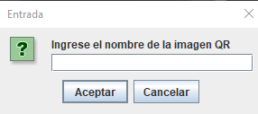
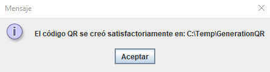

# GenerationQR

With this project, you can generate QR codes.

## Requirements

- <a href="https://www.java.com/es/download/ie_manual.jsp" target="_blank">Java (JVM)</a>

## Installation

1. Clone this repository

### Usage

1. Open GenerationQR.jar.
2. Write name of QR code.

3. Write the URL or text for which you want to create a QR code.

4. Search QR code generated in C:/Temp/GenerationQR.

### Features

* [Library zxing](https://zxing.github.io/zxing/apidocs/)